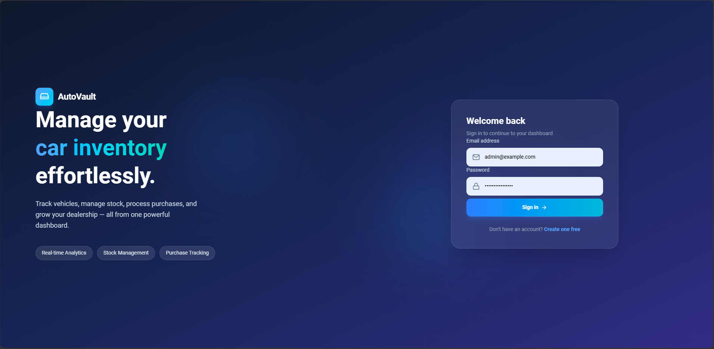
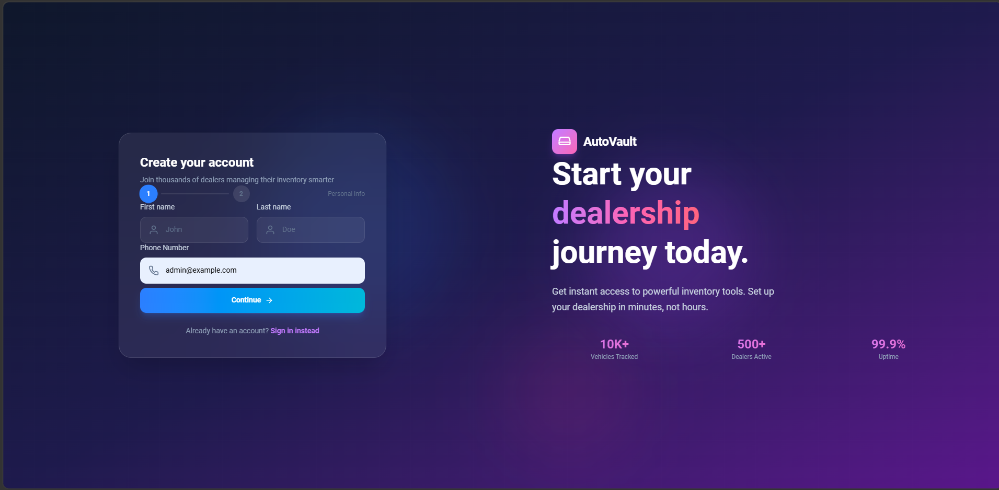
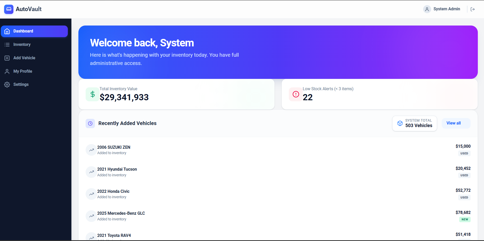
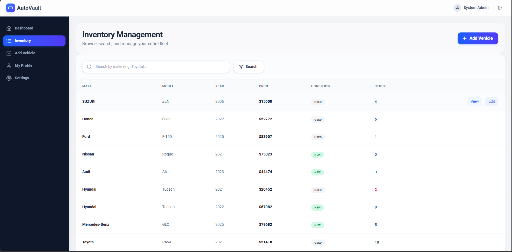
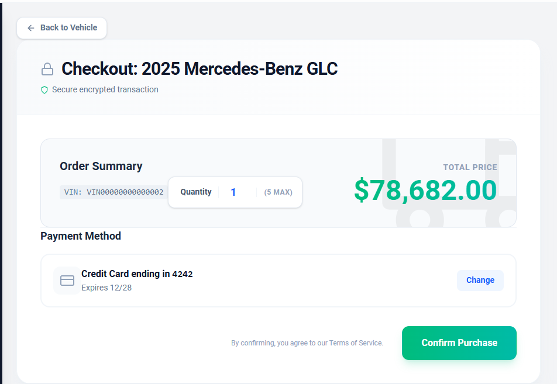
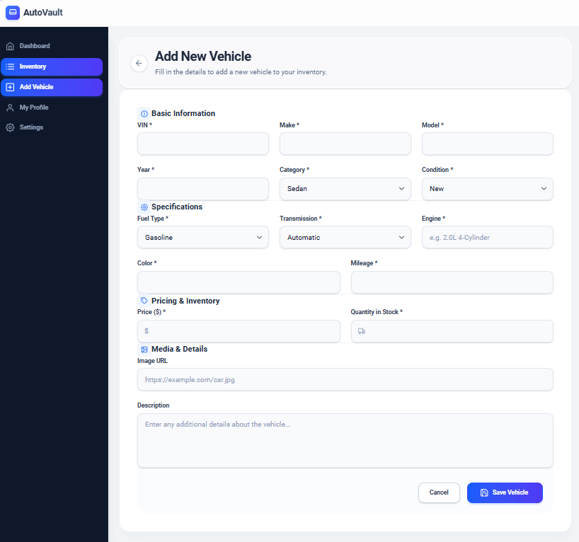
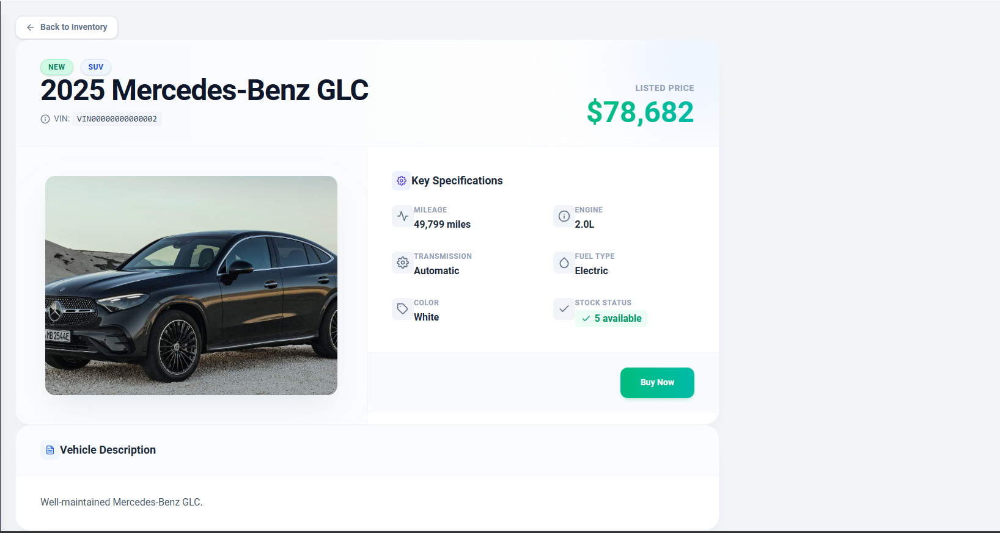
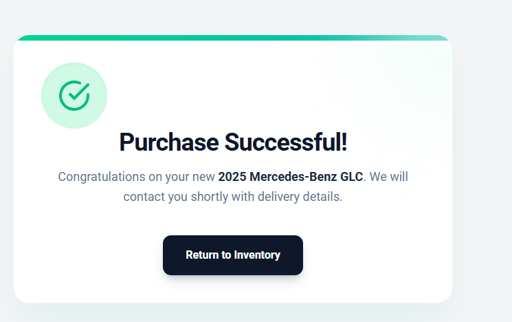
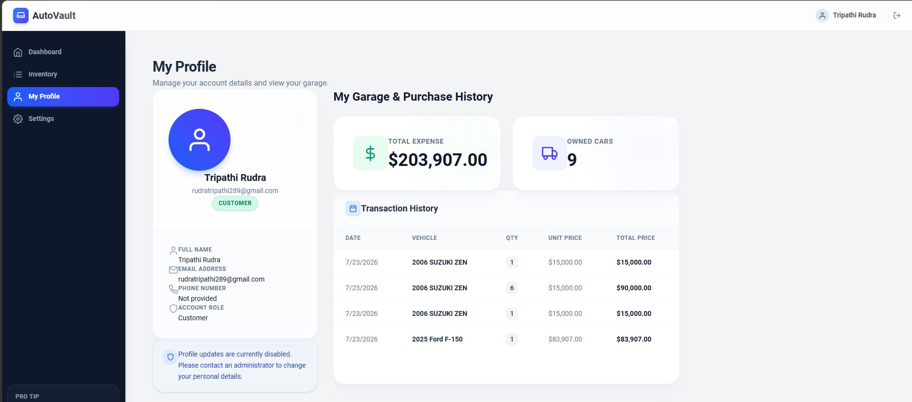

# AutoVault - Car Inventory Management System

AutoVault is a premium, modern, and highly responsive Car Inventory Management System built with the MERN stack (MongoDB, Express.js, React, Node.js). It provides a beautiful interface for dealerships to manage their vehicle stock, and for customers to browse, view detailed specifications, and securely purchase vehicles.

## 🚀 Live Demo

- **Frontend (Vercel):** [https://kata-car-inventory-management-syste-chi.vercel.app/](https://kata-car-inventory-management-syste-chi.vercel.app/)
- **Backend (Render):** [https://kata-car-inventory-management-system.onrender.com](https://kata-car-inventory-management-system.onrender.com) \
Example admin -- Email:admin@example.com \
                Password: adminpassword123 \
example customer -- email:rudratripathi289@gmail.com \
                     password: RATRIPATHI \
## 🌟 Features

### 👤 For Customers:
- **Authentication:** Secure Registration and Login with JWT.
- **Inventory Browsing:** View available vehicles, search, and filter.
- **Vehicle Details:** View comprehensive specifications and high-quality images.
- **Secure Checkout:** Purchase vehicles with a seamless and animated checkout flow.
- **User Profile:** Manage personal details and track complete purchase history/garage.

### 🛡️ For Administrators:
- **Dashboard Analytics:** High-level metrics for total inventory value, total vehicles, and low stock alerts.
- **Inventory Management:** Full CRUD capabilities to Add, Edit, and Delete vehicle records.
- **Stock Control:** Dedicated tools to quickly restock depleted vehicle quantities.
- **Pro Tips & Insights:** Real-time feedback on the health of the vehicle stock.

## 💻 Tech Stack

**Frontend:**
- React (Vite)
- Tailwind CSS (Premium Glassmorphism & Micro-animations)
- React Router DOM
- React Hook Form
- React Icons
- Axios

**Backend:**
- Node.js & Express.js
- MongoDB & Mongoose (Database)
- JWT (Authentication)
- bcryptjs (Password Hashing)

---

## 📸 Screenshots

### Authentication
#### Login Page


#### Register Page


### Core Application
#### Admin Dashboard


#### Vehicle Inventory


#### Vehicle Detailed View


### Management & Purchasing
#### Add/Edit Vehicle Form


#### Purchase Checkout


#### Purchase Successful


#### User Profile & Purchase History


---

## 🚀 Getting Started

### Prerequisites
- [Node.js](https://nodejs.org/) (v16+)
- [MongoDB](https://www.mongodb.com/) (Local instance or MongoDB Atlas cluster)

### Installation

1. **Clone the repository:**
   ```bash
   git clone https://github.com/your-username/kata-car-inventory-management-system.git
   cd kata-car-inventory-management-system
   ```

2. **Setup the Backend:**
   ```bash
   cd backend
   npm install
   ```
   Create a `.env` file in the `backend` directory based on `.env.example`:
   ```env
   PORT=5000
   MONGODB_URI=mongodb://localhost:27017/car-inventory
   JWT_SECRET=your_jwt_secret_key_here
   NODE_ENV=development
   ```
   Start the backend server:
   ```bash
   npm run dev
   ```

3. **Setup the Frontend:**
   Open a new terminal window:
   ```bash
   cd frontend
   npm install
   ```
   Create a `.env` file in the `frontend` directory:
   ```env
   VITE_API_URL=http://localhost:5000/api
   ```
   Start the frontend development server:
   ```bash
   npm run dev
   ```

## 🧪 Testing

The frontend is fully tested using **Vitest** and **React Testing Library**.

To run the frontend test suite:
```bash
cd frontend
npm run test
```

## 📄 License

This project is licensed under the MIT License.
